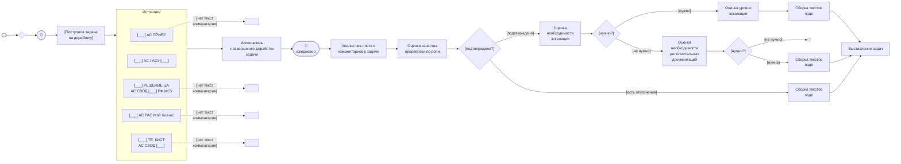

```mermaid
flowchart LR

  %% Start
  START([" "]) --> GATE1{ }

  %% Timer / wait
  GATE1 --> TIMER1(["⏱"])
  TIMER1 --> TASK_INPUT["[Поступила задача\nна доработку]"]

  %% Left block: info sources (swim-lane style list)
  TASK_INPUT --> SOURCES

  subgraph SOURCES["Источники"]
    S1["[___] АС ПРИЕР"]
    S2["[___] АС / АСУ [___]"]
    S3["[___] РЕШЕНИЕ ЦА\nАС СВОД [___] РФ МСУ"]
    S4["[___] АС РАС Мой бизнес"]
    S5["[___] ТЕ, КИСТ\nАС СВОД [___]"]
  end

  %% Annotations (comments) beside source rows
  S1 -. "[нет текст\nкомментария]" .-> ANNOT1[" "]
  S3 -. "[нет текст\nкомментария]" .-> ANNOT2[" "]
  S4 -. "[нет текст\nкомментария]" .-> ANNOT3[" "]
  S5 -. "[нет текст\nкомментария]" .-> ANNOT4[" "]

  %% Исполнитель / executor task
  SOURCES --> EXEC["Исполнитель\nк завершению доработки\nзадачи"]
  EXEC --> TIMER2(["⏱\nежедневно"])

  %% Analysis step
  TIMER2 --> ANALYZE["Анализ чек-листа и\nкомментариев к задаче"]

  %% Quality assessment
  ANALYZE --> QUALITY["Оценка качества\nпроработки по роли"]

  %% Decision: confirmed?
  QUALITY --> GATE2{"[подтверждено?]"}
  GATE2 -- "[подтверждено]" --> ASSESS_NEED["Оценка\nнеобходимости\nэскалации"]
  GATE2 -- "[есть отклонения]" --> COLLECT1["Сборка текстов\nподп"]

  %% Escalation needed?
  ASSESS_NEED --> GATE3{"[нужно?]"}
  GATE3 -- "[нужно]" --> ASSESS_LEVEL["Оценка уровня\nэскалации"]
  GATE3 -- "[не нужно]" --> ASSESS_DOCS["Оценка\nнеобходимости\nдополнительных\nдокументаций"]

  %% Escalation level → collect texts
  ASSESS_LEVEL --> COLLECT2["Сборка текстов\nподп"]

  %% Docs needed?
  ASSESS_DOCS --> GATE4{"[нужно?]"}
  GATE4 -- "[не нужно]" --> END_CIRCLE((" "))
  GATE4 -- "[нужно]" --> COLLECT3["Сборка текстов\nподп"]

  %% All collect paths merge → task creation
  COLLECT1 --> TASK_SET["Выставление задач"]
  COLLECT2 --> TASK_SET
  COLLECT3 --> TASK_SET
```
