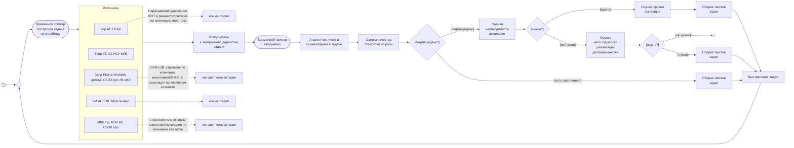

```mermaid
flowchart LR

  %% Start
  START([" "]) --> GATE1{ }

  %% Timer / wait
  GATE1 --> TIMER1(["Временной триггер\nПоступила задача\nна отработку"])

  %% Left block: info sources (swim-lane style list)
  TIMER1 --> SOURCES

  subgraph SOURCES["Источники"]
    S1["Упр АС ПРБР"]
    S2["ЗУпр КБ АС ИСУ КИБ"]
    S3["ЗУпр РБ/НУ/НО/МКК ЦА/nАС СБОЛ.про ЛК ИСУ"]
    S4["КМ АС ЕФС Мой бизнес"]
    S5["МКК ТБ, МЗП АС СБОЛ.про"]
  end

  %% Annotations (comments) beside source rows
  S1 -. "Наращивание/удержание ФОТ в рамках/nстратегии по ключевым клиентам" .-> ANNOT1["комментарии"]
  S3 -. "CKM-CIB: стратегия по ключевым клиентам/nCKM-CIB: эскалация по ключевым клиентам" .-> ANNOT2["чек-лист комментарии"]
  S4 .-> ANNOT3["комментарии"]
  S5 -. "стратегия по ключевым клиентам/nэскалация по ключевым клиентам" .-> ANNOT4["чек-лист комментарии"]

  %% Исполнитель / executor task
  SOURCES --> EXEC["Исполнитель\nк завершению доработки\nзадачи"]
  EXEC --> TIMER2(["Временной триггер\nежедневно"])

  %% Analysis step
  TIMER2 --> ANALYZE["Анализ чек-листа и\nкомментариев к задаче"]

  %% Quality assessment
  ANALYZE --> QUALITY["Оценка качества\nотработки по роли"]

  %% Decision: confirmed?
  QUALITY --> GATE2{"[подтверждено?]"}
  GATE2 -- "[подтверждено]" --> ASSESS_NEED["Оценка\nнеобходимости\nэскалации"]
  GATE2 -- "[есть отклонения]" --> COLLECT1["Сборка текстов\nзадач"]

  %% Escalation needed?
  ASSESS_NEED --> GATE3{"[нужно?]"}
  GATE3 -- "[нужно]" --> ASSESS_LEVEL["Оценка уровня\nэскалации"]
  GATE3 -- "[не нужно]" --> ASSESS_DOCS["Оценка\nнеобходимости\nреализации\nдоговоренностей"]

  %% Escalation level → collect texts
  ASSESS_LEVEL --> COLLECT2["Сборка текстов\nзадач"]

  %% Docs needed?
  ASSESS_DOCS --> GATE4{"[нужно?]"}
  GATE4 -- "[не нужно]" --> END_CIRCLE((" "))
  GATE4 -- "[нужно]" --> COLLECT3["Сборка текстов\nзадач"]

  %% All collect paths merge → task creation
  COLLECT1 --> TASK_SET["Выставление задач"]
  COLLECT2 --> TASK_SET
  COLLECT3 --> TASK_SET
  TASK_SET --> GATE1
```
